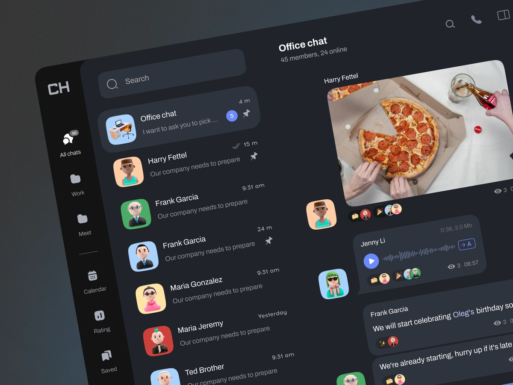

<h1 align="center">
  Chat App Django ChatGPT
</h1>

<h3 align="center">
  Chatting App
</h3>

  

This is an AI-Chatbot just like <b>Chat GPT</b>. We are using Django and Open-AI API to build this. It is going to be a chatbot where you can ask it questions and it's going to give responses to that question. We have also implemented user authentication.So, we're going to allow a user to register and login to our platform. And whenever a user logs out and logs back in and they're going to see the history of messages that they've sent before
   
Chat_App_Django_ChatGPT is an innovative project that combines the power of Django, a robust web framework, with the cutting-edge language model ChatGPT to create a dynamic and interactive chat application. This application leverages the advanced natural language processing capabilities of ChatGPT to provide users with an engaging and intelligent chat experience. 
  
The Chat_App_Django_ChatGPT repository offers a comprehensive solution for building a chat application that can handle a wide range of conversational scenarios. By utilizing Django, the project benefits from its scalability, security, and extensive ecosystem of plugins and libraries. With ChatGPT, powered by OpenAI's state-of-the-art language model, the application is capable of understanding user inputs, generating relevant and context-aware responses, and engaging in meaningful conversations.
The Chat_App_Django_ChatGPT repository provides extensive documentation, guiding developers through the setup, installation, and configuration processes. The codebase is well-structured, following best practices and design patterns to facilitate maintainability and extensibility.
  
This project serves as a valuable resource for developers interested in building intelligent chat applications using Django and ChatGPT. It showcases the seamless integration of powerful technologies to create an immersive and dynamic chat experience. By exploring the code and documentation, developers can gain insights into building scalable, secure, and intelligent chat applications for a wide range of use cases.
  
Overall, the Chat_App_Django_ChatGPT repository empowers developers to harness the potential of Django and ChatGPT, revolutionizing the way users engage in conversations online. It opens up possibilities for creating chat applications that are not only interactive and engaging but also capable of providing intelligent responses, making communication more natural and seamless.

  
<!-- ................................................................................................................................. -->

### Features
 
Following are some of the new features and learning encountered while creating this amazing project:

- User Registration and Authentication: The application allows users to create accounts, log in securely, and maintain personalized profiles. This ensures that users can access their chat history and preferences.
- Real-time Chat Functionality: Users can engage in real-time conversations, sending and receiving messages instantaneously. The application offers a sleek and user-friendly interface, making it easy to navigate and interact with chat threads.
- Intelligent Chatbot Capabilities: Leveraging ChatGPT, the application provides users with an intelligent chatbot that can understand natural language inputs, interpret context, and generate relevant and coherent responses. This enhances the conversational experience and creates the illusion of interacting with a human-like entity.
- Chat History and Search: The application stores chat histories, allowing users to revisit previous conversations. The search functionality enables users to quickly find specific messages or discussions within their chat history.
- Customization and Personalization: Users can customize their profiles, including profile pictures, display names, and other preferences. This adds a personal touch to the chat experience and promotes a sense of individuality.
- Scalability and Security: The Django framework ensures scalability and robustness, enabling the application to handle a large number of concurrent users. Additionally, the application implements robust security measures to protect user data and ensure privacy.

  
<!-- ................................................................................................................................. -->

### Resources
 
Follwing resources have been used in maintaining this project:

- [Open AI Documentation](https://platform.openai.com/docs/introduction)

  
<!-- ................................................................................................................................. -->

### App's Interface
  

  
<!-- ................................................................................................................................. -->

### Technology Stack
 
Follwing technologies have been used at the core of this application to make it stand in the market place:

- HTML
- CSS
- JavaScript
- Django
- Open AI API 

  
<!-- ................................................................................................................................. -->

### Advancement

> GUI can be made better

  
<!-- ................................................................................................................................. -->

### Developer

Muhammad Abdullah Butt  
abdullahbutt12292210@gmail.com  
> [Instagram](https://www.instagram.com/abdullah.butt.22/) 
> [FaceBook](https://www.facebook.com/profile.php?id=100076291614529) 
> [YouTube](https://www.youtube.com/channel/UCnuOFQyMywg-KuoN-lmav1Q) 
> [Portfolio](https://rebrand.ly/MuhammadAbdullahButt_MABCORP) 
> [Project Displayer]( https://rebrand.ly/ProjectDisplayer_MABCORP)
  
<!-- ................................................................................................................................. -->

